# Prompt Proxy Architecture 

## 1. Background & Constraints
- **Leave OpenCode untouched**: `packages/opencode` remains a read-only submodule so upstream updates can land without conflict.
- **Externalized prompts**: System prompts and model parameters live in plugin-managed files that are version-controlled, reviewable, and easy to roll back.
- **Project-level isolation**: Each worktree owns its own `.opencode/` folder, which keeps template overrides scoped per project or per environment.

## 2. High-Level Topology
```
┌──────────────┐        ┌────────────────────┐        ┌──────────────────────┐
│  OpenCode    │hooks   │ Prompt Proxy Plugin│calls   │ @tmuxcoder/prompt-core│
│ (submodule)  ├──────▶ │ .opencode/plugin/  ├──────▶ │ (Local Resolver SDK)  │
└──────────────┘        └────────────────────┘        ├───────────────┬──────┘
                                                      │templates/     │parameters/
                                                      ▼               ▼
                                             .opencode/prompts/templates/*.txt
                                             .opencode/prompts/parameters.json
```
- OpenCode invokes `chat.message` / `chat.params` hooks; the plugin decides the final system prompt and model parameters.
- The Prompt-core SDK renders templates and merges parameters; additional resolver modes (remote/hybrid) can be added without touching OpenCode.

## 3. Key Components
1. **Prompt Proxy Plugin** (`.opencode/plugin/prompt-proxy.ts`)
   - Reads `.opencode/prompts/config.json`, instantiates `TmuxCoderPrompts`, and prepares a per-session parameter cache.
   - `chat.message` enriches the context with git metadata (`git -C <worktree>`), calls the SDK, overrides `output.message.system`, and caches parameter overrides.
   - `chat.params` consumes cached parameters to set temperature/topP/model options (e.g., `options.thinking`); `event` hooks clear caches when sessions end.
   - Applies a config-driven monkey patch to OpenCode’s `SystemPrompt`, guaranteeing that environment/custom blocks are only appended when explicitly allowed (`monkeyPatch` section in `config.json`).
   - Honors `promptProxy.enabled/overrideSystem/overrideParams` switches so teams can compare baseline OpenCode behavior vs. Prompt Proxy without uninstalling the plugin.
2. **Prompt-core SDK** (`prompt-core/src`)
   - `TmuxCoderPrompts` manages resolver lifecycle plus an in-memory cache so multiple hooks in the same session reuse results.
   - `LocalResolver` composes:
     - `TemplateEngine`: Handlebars templates per agent (`templates/<agent>.txt`) with helpers such as `formatDate` and `uppercase`.
     - `ParameterManager`: Folds parameters in the order **defaults → model → agent**.
3. **Configuration assets** (`.opencode/prompts`)
   - `templates/` and `parameters.json` are Git-friendly, enabling change reviews and audit trails.
   - `config.json` controls resolver mode plus cache TTL/size, allowing per-project overrides.

## 4. Detailed Project Flow

```mermaid
flowchart LR
    A["User submits message<br/>via TmuxCoder pane"] --> B["OpenCode fires<br/>chat.message hook"]
    B --> C["Prompt Proxy Plugin builds PromptContext<br/>agent/session/project/git/model/env"]
    C --> D{Prompt-core cache hit?}
    D -- Yes --> E["Return cached<br/>system + params"]
    D -- No --> F["LocalResolver pipeline"]
    F --> F1["TemplateEngine renders<br/>agent template with context"]
    F --> F2["ParameterManager merges<br/>defaults → model → agent"]
    F1 --> G["Compose ResolvedPrompt<br/>{system, parameters, metadata}"]
    F2 --> G
    G --> H["Plugin overrides output.message.system<br/>and caches parameters by session ID"]
    H --> I["OpenCode fires chat.params"]
    I --> J["Plugin mutates temperature/topP/options"]
    J --> K["Provider receives customized prompt + params"]
    K --> L["session.completed/session.deleted<br/>event clears SDK caches"]
```


## 5. Isolation & Versioning Strategy
- **Isolation**: `.opencode/prompts` is scoped to the repo/worktree, so overrides never leak across projects. CI agents can vend project-specific bundles by copying this directory.
- **Version control**: Templates and JSON configs change through regular pull requests, ensuring prompt adjustments are reviewed, traceable, and easy to revert.
- **Prompt Proxy toggles**: `promptProxy.enabled/overrideSystem/overrideParams` let you switch back to vanilla OpenCode behavior for quick comparisons without uninstalling the plugin.

## 6. Extending Variables (Variable Providers)
Hardcoded variables (like `{{timestamp}}`) are replaced by an extensible provider system in `.opencode/plugin/variable-providers.ts`.

### Built-in Providers
- **Time**: `{{timestamp}}` (ISO), `{{date_ymd}}`, `{{time_hms}}`, `{{time_human}}`
- **Git**: `{{git_branch}}`, `{{git_dirty}}`, `{{git_root}}`
- **System**: `{{os_platform}}`, `{{node_env}}`

### How to Add Custom Variables
1. Open `.opencode/plugin/variable-providers.ts`.
2. Define a new `VariableProvider` function:
   ```typescript
   export const myProvider: VariableProvider = async ({ env }) => {
     return {
       api_key_status: env.API_KEY ? "set" : "missing",
       custom_role: "developer"
     }
   }
   ```
3. Register it in the `providers` object:
   ```typescript
   const providers = {
     // ... exisiting
     my: myProvider
   }
   ```
4. Use `{{custom_role}}` directly in your templates (`.opencode/prompts/templates/*.txt`). If you set `providers.custom.namespace`, the plugin automatically rewrites custom variables to use that prefix (e.g., `namespace: "ops"` ⇒ `{{ops_custom_role}}`).

## 7. Extension Opportunities
- **Remote mode**: `PromptConfig.mode` already reserves `remote`/`hybrid`; swapping `LocalResolver` for an HTTP resolver requires zero OpenCode changes and keeps local files as fallback.
- **Observability**: The plugin can emit structured logs or forward telemetry to shared sinks (example uses `console.log`) to trace which template and parameter set applied to each session.
- **Security**: For cross-team deployments, add allowlists or signature checks inside the plugin to ensure only trusted template bundles are loaded.
***
